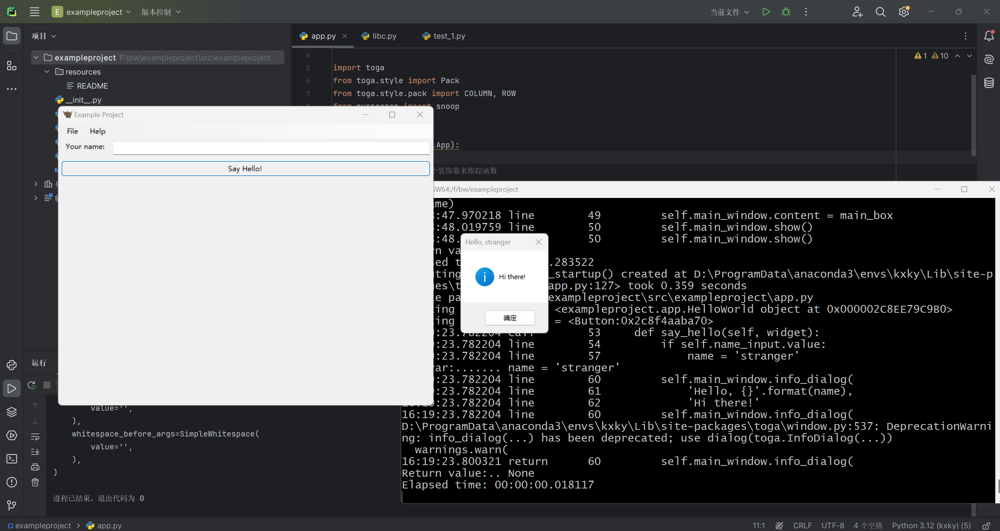
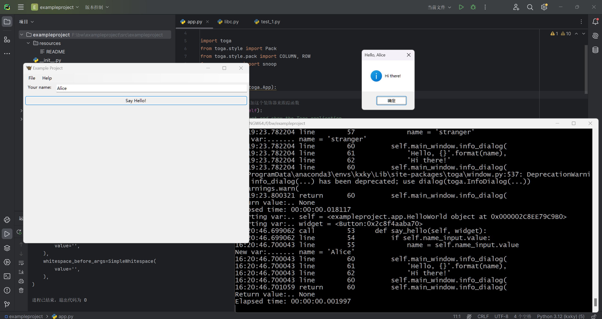
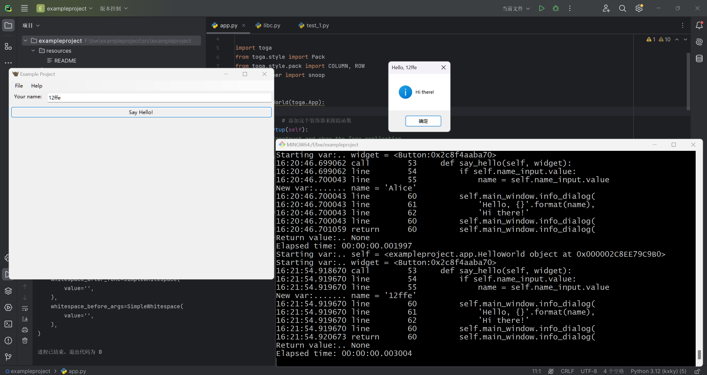
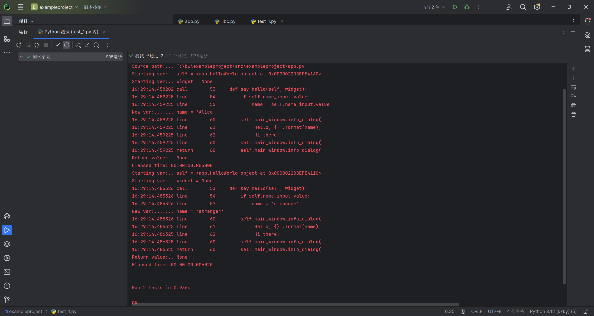

## 1.libc.py脚本，查找所有创建Toga小部件的实例
结果：
```
D:\ProgramData\anaconda3\envs\kxky\python.exe F:\bw\exampleproject\src\exampleproject\libc.py 
Found widget creation: Call(
    func=Attribute(
        value=Name(
            value='toga',
            lpar=[],
            rpar=[],
        ),
        attr=Name(
            value='Box',
            lpar=[],
            rpar=[],
        ),
        dot=Dot(
            whitespace_before=SimpleWhitespace(
                value='',
            ),
            whitespace_after=SimpleWhitespace(
                value='',
            ),
        ),
        lpar=[],
        rpar=[],
    ),
    args=[
        Arg(
            value=Call(
                func=Name(
                    value='Pack',
                    lpar=[],
                    rpar=[],
                ),
                args=[
                    Arg(
                        value=Name(
                            value='COLUMN',
                            lpar=[],
                            rpar=[],
                        ),
                        keyword=Name(
                            value='direction',
                            lpar=[],
                            rpar=[],
                        ),
                        equal=AssignEqual(
                            whitespace_before=SimpleWhitespace(
                                value='',
                            ),
                            whitespace_after=SimpleWhitespace(
                                value='',
                            ),
                        ),
                        comma=MaybeSentinel.DEFAULT,
                        star='',
                        whitespace_after_star=SimpleWhitespace(
                            value='',
                        ),
                        whitespace_after_arg=SimpleWhitespace(
                            value='',
                        ),
                    ),
                ],
                lpar=[],
                rpar=[],
                whitespace_after_func=SimpleWhitespace(
                    value='',
                ),
                whitespace_before_args=SimpleWhitespace(
                    value='',
                ),
            ),
            keyword=Name(
                value='style',
                lpar=[],
                rpar=[],
            ),
            equal=AssignEqual(
                whitespace_before=SimpleWhitespace(
                    value='',
                ),
                whitespace_after=SimpleWhitespace(
                    value='',
                ),
            ),
            comma=MaybeSentinel.DEFAULT,
            star='',
            whitespace_after_star=SimpleWhitespace(
                value='',
            ),
            whitespace_after_arg=SimpleWhitespace(
                value='',
            ),
        ),
    ],
    lpar=[],
    rpar=[],
    whitespace_after_func=SimpleWhitespace(
        value='',
    ),
    whitespace_before_args=SimpleWhitespace(
        value='',
    ),
)
Found widget creation: Call(
    func=Attribute(
        value=Name(
            value='toga',
            lpar=[],
            rpar=[],
        ),
        attr=Name(
            value='Label',
            lpar=[],
            rpar=[],
        ),
        dot=Dot(
            whitespace_before=SimpleWhitespace(
                value='',
            ),
            whitespace_after=SimpleWhitespace(
                value='',
            ),
        ),
        lpar=[],
        rpar=[],
    ),
    args=[
        Arg(
            value=SimpleString(
                value="'Your name: '",
                lpar=[],
                rpar=[],
            ),
            keyword=None,
            equal=MaybeSentinel.DEFAULT,
            comma=Comma(
                whitespace_before=SimpleWhitespace(
                    value='',
                ),
                whitespace_after=ParenthesizedWhitespace(
                    first_line=TrailingWhitespace(
                        whitespace=SimpleWhitespace(
                            value='',
                        ),
                        comment=None,
                        newline=Newline(
                            value=None,
                        ),
                    ),
                    empty_lines=[],
                    indent=True,
                    last_line=SimpleWhitespace(
                        value='    ',
                    ),
                ),
            ),
            star='',
            whitespace_after_star=SimpleWhitespace(
                value='',
            ),
            whitespace_after_arg=SimpleWhitespace(
                value='',
            ),
        ),
        Arg(
            value=Call(
                func=Name(
                    value='Pack',
                    lpar=[],
                    rpar=[],
                ),
                args=[
                    Arg(
                        value=Tuple(
                            elements=[
                                Element(
                                    value=Integer(
                                        value='0',
                                        lpar=[],
                                        rpar=[],
                                    ),
                                    comma=Comma(
                                        whitespace_before=SimpleWhitespace(
                                            value='',
                                        ),
                                        whitespace_after=SimpleWhitespace(
                                            value=' ',
                                        ),
                                    ),
                                ),
                                Element(
                                    value=Integer(
                                        value='5',
                                        lpar=[],
                                        rpar=[],
                                    ),
                                    comma=MaybeSentinel.DEFAULT,
                                ),
                            ],
                            lpar=[
                                LeftParen(
                                    whitespace_after=SimpleWhitespace(
                                        value='',
                                    ),
                                ),
                            ],
                            rpar=[
                                RightParen(
                                    whitespace_before=SimpleWhitespace(
                                        value='',
                                    ),
                                ),
                            ],
                        ),
                        keyword=Name(
                            value='padding',
                            lpar=[],
                            rpar=[],
                        ),
                        equal=AssignEqual(
                            whitespace_before=SimpleWhitespace(
                                value='',
                            ),
                            whitespace_after=SimpleWhitespace(
                                value='',
                            ),
                        ),
                        comma=MaybeSentinel.DEFAULT,
                        star='',
                        whitespace_after_star=SimpleWhitespace(
                            value='',
                        ),
                        whitespace_after_arg=SimpleWhitespace(
                            value='',
                        ),
                    ),
                ],
                lpar=[],
                rpar=[],
                whitespace_after_func=SimpleWhitespace(
                    value='',
                ),
                whitespace_before_args=SimpleWhitespace(
                    value='',
                ),
            ),
            keyword=Name(
                value='style',
                lpar=[],
                rpar=[],
            ),
            equal=AssignEqual(
                whitespace_before=SimpleWhitespace(
                    value='',
                ),
                whitespace_after=SimpleWhitespace(
                    value='',
                ),
            ),
            comma=MaybeSentinel.DEFAULT,
            star='',
            whitespace_after_star=SimpleWhitespace(
                value='',
            ),
            whitespace_after_arg=ParenthesizedWhitespace(
                first_line=TrailingWhitespace(
                    whitespace=SimpleWhitespace(
                        value='',
                    ),
                    comment=None,
                    newline=Newline(
                        value=None,
                    ),
                ),
                empty_lines=[],
                indent=True,
                last_line=SimpleWhitespace(
                    value='',
                ),
            ),
        ),
    ],
    lpar=[],
    rpar=[],
    whitespace_after_func=SimpleWhitespace(
        value='',
    ),
    whitespace_before_args=ParenthesizedWhitespace(
        first_line=TrailingWhitespace(
            whitespace=SimpleWhitespace(
                value='',
            ),
            comment=None,
            newline=Newline(
                value=None,
            ),
        ),
        empty_lines=[],
        indent=True,
        last_line=SimpleWhitespace(
            value='    ',
        ),
    ),
)
Found widget creation: Call(
    func=Attribute(
        value=Name(
            value='toga',
            lpar=[],
            rpar=[],
        ),
        attr=Name(
            value='TextInput',
            lpar=[],
            rpar=[],
        ),
        dot=Dot(
            whitespace_before=SimpleWhitespace(
                value='',
            ),
            whitespace_after=SimpleWhitespace(
                value='',
            ),
        ),
        lpar=[],
        rpar=[],
    ),
    args=[
        Arg(
            value=Call(
                func=Name(
                    value='Pack',
                    lpar=[],
                    rpar=[],
                ),
                args=[
                    Arg(
                        value=Integer(
                            value='1',
                            lpar=[],
                            rpar=[],
                        ),
                        keyword=Name(
                            value='flex',
                            lpar=[],
                            rpar=[],
                        ),
                        equal=AssignEqual(
                            whitespace_before=SimpleWhitespace(
                                value='',
                            ),
                            whitespace_after=SimpleWhitespace(
                                value='',
                            ),
                        ),
                        comma=MaybeSentinel.DEFAULT,
                        star='',
                        whitespace_after_star=SimpleWhitespace(
                            value='',
                        ),
                        whitespace_after_arg=SimpleWhitespace(
                            value='',
                        ),
                    ),
                ],
                lpar=[],
                rpar=[],
                whitespace_after_func=SimpleWhitespace(
                    value='',
                ),
                whitespace_before_args=SimpleWhitespace(
                    value='',
                ),
            ),
            keyword=Name(
                value='style',
                lpar=[],
                rpar=[],
            ),
            equal=AssignEqual(
                whitespace_before=SimpleWhitespace(
                    value='',
                ),
                whitespace_after=SimpleWhitespace(
                    value='',
                ),
            ),
            comma=MaybeSentinel.DEFAULT,
            star='',
            whitespace_after_star=SimpleWhitespace(
                value='',
            ),
            whitespace_after_arg=SimpleWhitespace(
                value='',
            ),
        ),
    ],
    lpar=[],
    rpar=[],
    whitespace_after_func=SimpleWhitespace(
        value='',
    ),
    whitespace_before_args=SimpleWhitespace(
        value='',
    ),
)
Found widget creation: Call(
    func=Attribute(
        value=Name(
            value='toga',
            lpar=[],
            rpar=[],
        ),
        attr=Name(
            value='Box',
            lpar=[],
            rpar=[],
        ),
        dot=Dot(
            whitespace_before=SimpleWhitespace(
                value='',
            ),
            whitespace_after=SimpleWhitespace(
                value='',
            ),
        ),
        lpar=[],
        rpar=[],
    ),
    args=[
        Arg(
            value=Call(
                func=Name(
                    value='Pack',
                    lpar=[],
                    rpar=[],
                ),
                args=[
                    Arg(
                        value=Name(
                            value='ROW',
                            lpar=[],
                            rpar=[],
                        ),
                        keyword=Name(
                            value='direction',
                            lpar=[],
                            rpar=[],
                        ),
                        equal=AssignEqual(
                            whitespace_before=SimpleWhitespace(
                                value='',
                            ),
                            whitespace_after=SimpleWhitespace(
                                value='',
                            ),
                        ),
                        comma=Comma(
                            whitespace_before=SimpleWhitespace(
                                value='',
                            ),
                            whitespace_after=SimpleWhitespace(
                                value=' ',
                            ),
                        ),
                        star='',
                        whitespace_after_star=SimpleWhitespace(
                            value='',
                        ),
                        whitespace_after_arg=SimpleWhitespace(
                            value='',
                        ),
                    ),
                    Arg(
                        value=Integer(
                            value='5',
                            lpar=[],
                            rpar=[],
                        ),
                        keyword=Name(
                            value='padding',
                            lpar=[],
                            rpar=[],
                        ),
                        equal=AssignEqual(
                            whitespace_before=SimpleWhitespace(
                                value='',
                            ),
                            whitespace_after=SimpleWhitespace(
                                value='',
                            ),
                        ),
                        comma=MaybeSentinel.DEFAULT,
                        star='',
                        whitespace_after_star=SimpleWhitespace(
                            value='',
                        ),
                        whitespace_after_arg=SimpleWhitespace(
                            value='',
                        ),
                    ),
                ],
                lpar=[],
                rpar=[],
                whitespace_after_func=SimpleWhitespace(
                    value='',
                ),
                whitespace_before_args=SimpleWhitespace(
                    value='',
                ),
            ),
            keyword=Name(
                value='style',
                lpar=[],
                rpar=[],
            ),
            equal=AssignEqual(
                whitespace_before=SimpleWhitespace(
                    value='',
                ),
                whitespace_after=SimpleWhitespace(
                    value='',
                ),
            ),
            comma=MaybeSentinel.DEFAULT,
            star='',
            whitespace_after_star=SimpleWhitespace(
                value='',
            ),
            whitespace_after_arg=SimpleWhitespace(
                value='',
            ),
        ),
    ],
    lpar=[],
    rpar=[],
    whitespace_after_func=SimpleWhitespace(
        value='',
    ),
    whitespace_before_args=SimpleWhitespace(
        value='',
    ),
)
Found widget creation: Call(
    func=Attribute(
        value=Name(
            value='toga',
            lpar=[],
            rpar=[],
        ),
        attr=Name(
            value='Button',
            lpar=[],
            rpar=[],
        ),
        dot=Dot(
            whitespace_before=SimpleWhitespace(
                value='',
            ),
            whitespace_after=SimpleWhitespace(
                value='',
            ),
        ),
        lpar=[],
        rpar=[],
    ),
    args=[
        Arg(
            value=SimpleString(
                value="'Say Hello!'",
                lpar=[],
                rpar=[],
            ),
            keyword=None,
            equal=MaybeSentinel.DEFAULT,
            comma=Comma(
                whitespace_before=SimpleWhitespace(
                    value='',
                ),
                whitespace_after=ParenthesizedWhitespace(
                    first_line=TrailingWhitespace(
                        whitespace=SimpleWhitespace(
                            value='',
                        ),
                        comment=None,
                        newline=Newline(
                            value=None,
                        ),
                    ),
                    empty_lines=[],
                    indent=True,
                    last_line=SimpleWhitespace(
                        value='      ',
                    ),
                ),
            ),
            star='',
            whitespace_after_star=SimpleWhitespace(
                value='',
            ),
            whitespace_after_arg=SimpleWhitespace(
                value='',
            ),
        ),
        Arg(
            value=Attribute(
                value=Name(
                    value='self',
                    lpar=[],
                    rpar=[],
                ),
                attr=Name(
                    value='say_hello',
                    lpar=[],
                    rpar=[],
                ),
                dot=Dot(
                    whitespace_before=SimpleWhitespace(
                        value='',
                    ),
                    whitespace_after=SimpleWhitespace(
                        value='',
                    ),
                ),
                lpar=[],
                rpar=[],
            ),
            keyword=Name(
                value='on_press',
                lpar=[],
                rpar=[],
            ),
            equal=AssignEqual(
                whitespace_before=SimpleWhitespace(
                    value=' ',
                ),
                whitespace_after=SimpleWhitespace(
                    value=' ',
                ),
            ),
            comma=Comma(
                whitespace_before=SimpleWhitespace(
                    value='',
                ),
                whitespace_after=ParenthesizedWhitespace(
                    first_line=TrailingWhitespace(
                        whitespace=SimpleWhitespace(
                            value='',
                        ),
                        comment=None,
                        newline=Newline(
                            value=None,
                        ),
                    ),
                    empty_lines=[],
                    indent=True,
                    last_line=SimpleWhitespace(
                        value='      ',
                    ),
                ),
            ),
            star='',
            whitespace_after_star=SimpleWhitespace(
                value='',
            ),
            whitespace_after_arg=SimpleWhitespace(
                value='',
            ),
        ),
        Arg(
            value=Call(
                func=Name(
                    value='Pack',
                    lpar=[],
                    rpar=[],
                ),
                args=[
                    Arg(
                        value=Integer(
                            value='5',
                            lpar=[],
                            rpar=[],
                        ),
                        keyword=Name(
                            value='padding',
                            lpar=[],
                            rpar=[],
                        ),
                        equal=AssignEqual(
                            whitespace_before=SimpleWhitespace(
                                value='',
                            ),
                            whitespace_after=SimpleWhitespace(
                                value='',
                            ),
                        ),
                        comma=MaybeSentinel.DEFAULT,
                        star='',
                        whitespace_after_star=SimpleWhitespace(
                            value='',
                        ),
                        whitespace_after_arg=SimpleWhitespace(
                            value='',
                        ),
                    ),
                ],
                lpar=[],
                rpar=[],
                whitespace_after_func=SimpleWhitespace(
                    value='',
                ),
                whitespace_before_args=SimpleWhitespace(
                    value='',
                ),
            ),
            keyword=Name(
                value='style',
                lpar=[],
                rpar=[],
            ),
            equal=AssignEqual(
                whitespace_before=SimpleWhitespace(
                    value=' ',
                ),
                whitespace_after=SimpleWhitespace(
                    value=' ',
                ),
            ),
            comma=MaybeSentinel.DEFAULT,
            star='',
            whitespace_after_star=SimpleWhitespace(
                value='',
            ),
            whitespace_after_arg=ParenthesizedWhitespace(
                first_line=TrailingWhitespace(
                    whitespace=SimpleWhitespace(
                        value='',
                    ),
                    comment=None,
                    newline=Newline(
                        value=None,
                    ),
                ),
                empty_lines=[],
                indent=True,
                last_line=SimpleWhitespace(
                    value='',
                ),
            ),
        ),
    ],
    lpar=[],
    rpar=[],
    whitespace_after_func=SimpleWhitespace(
        value='',
    ),
    whitespace_before_args=ParenthesizedWhitespace(
        first_line=TrailingWhitespace(
            whitespace=SimpleWhitespace(
                value='',
            ),
            comment=None,
            newline=Newline(
                value=None,
            ),
        ),
        empty_lines=[],
        indent=True,
        last_line=SimpleWhitespace(
            value='',
        ),
    ),
)
Found widget creation: Call(
    func=Attribute(
        value=Name(
            value='toga',
            lpar=[],
            rpar=[],
        ),
        attr=Name(
            value='MainWindow',
            lpar=[],
            rpar=[],
        ),
        dot=Dot(
            whitespace_before=SimpleWhitespace(
                value='',
            ),
            whitespace_after=SimpleWhitespace(
                value='',
            ),
        ),
        lpar=[],
        rpar=[],
    ),
    args=[
        Arg(
            value=Attribute(
                value=Name(
                    value='self',
                    lpar=[],
                    rpar=[],
                ),
                attr=Name(
                    value='formal_name',
                    lpar=[],
                    rpar=[],
                ),
                dot=Dot(
                    whitespace_before=SimpleWhitespace(
                        value='',
                    ),
                    whitespace_after=SimpleWhitespace(
                        value='',
                    ),
                ),
                lpar=[],
                rpar=[],
            ),
            keyword=Name(
                value='title',
                lpar=[],
                rpar=[],
            ),
            equal=AssignEqual(
                whitespace_before=SimpleWhitespace(
                    value='',
                ),
                whitespace_after=SimpleWhitespace(
                    value='',
                ),
            ),
            comma=MaybeSentinel.DEFAULT,
            star='',
            whitespace_after_star=SimpleWhitespace(
                value='',
            ),
            whitespace_after_arg=SimpleWhitespace(
                value='',
            ),
        ),
    ],
    lpar=[],
    rpar=[],
    whitespace_after_func=SimpleWhitespace(
        value='',
    ),
    whitespace_before_args=SimpleWhitespace(
        value='',
    ),
)

进程已结束，退出代码为 0


```

## 2.使用 Pysnooper 进行动态分析，使用pysnooper装饰器来跟踪函数的行为







## 3.编写一些单元测试来验证say_hello方法的行为




# 以上暂未发现bug

